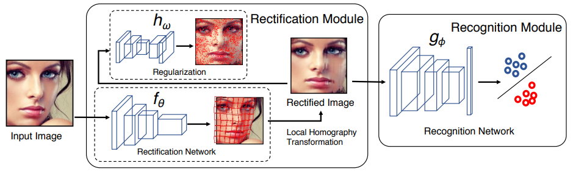

本篇博客记录一些人脸识别领域的经典论文以及最新论文的阅读笔记。

---
LFW、YTF、MegaFace测试基准

Models | LFW | YTF | MegaFace | Model Size | Training Images
---------|----------|----------|----------|----------|----------
MML | 99.63% | 95.5% | / | / | 3M
Git Loss | 99.3% | 95.3% | / | / | 3M
GridFace-8 | 99.7% | 95.6% | / | / | /
Contrastive CNN | 99.12% | / | / | / | WebFace
PRN+ | 99.76% | 96.3% | / | / | 2.8M
MobiFace | 99.7% | / | 91.3% | 9.3MB | 3.8M
MobileFaceNet | 99.48% | / | 90.71% | 4MB | 3.8M
Google-FaceNet | 99.63% | 95.1% | 86.47% | 30MB | 200M
MobileNet_V1 | 99.5% | / | 92.65% | 112MB | 3.8M
CosFace | 99.73% | / | / | / | 5M
ArcFace | 99.78% | / | / | / | 3.1M
LightCNN | 99.33% | / | / | 50MB | 4M
CenterFace | 99.28% | 94.9% | / | / | 0.7M
SphereFace | 99.42% | 95% | / | / | 0.49M
NAN | / | 95.7% | / | / | 3M
---

#### **DeepFace**: *Closing the Gap to Human-Level Performance in Face Verification (CVPR 2014, Facebook AI)*
+ paper: [DeepFace](https://www.cs.toronto.edu/~ranzato/publications/taigman_cvpr14.pdf)

#### **DeepID**: *Deep Learning Face Representation from Predicting 10,000 Classes (CVPR 2014)*
+ paper: [DeepID](http://mmlab.ie.cuhk.edu.hk/pdf/YiSun_CVPR14.pdf)
+ codes: [DeepID_FaceClassify](https://github.com/stdcoutzyx/DeepID_FaceClassify)

#### **DeepID2**: *Deep Learning Face Representation by Joint Identification-Verification*
+ paper: [DeepID2](http://papers.nips.cc/paper/5416-analog-memories-in-a-balanced-rate-based-network-of-e-i-neurons)
+ codes: [基于Caffe的DeepID2实现](https://www.miaoerduo.com/deep-learning)

#### **DeepID2+**: *Deeply learned face representations are sparse, selective, and robust*
+ paper: [DeepID2+](http://arxiv.org/abs/1412.1265)
+ video: [xiaogang wang的视频讲解](http://research.microsoft.com/apps/video/?id=260023)

#### **DeepID3**: *Face Recognition with Very Deep Neural Networks (2015.2)*
+ paper: [DeepID3](https://arxiv.org/pdf/1502.00873v1.pdf)

#### **VGGFace**: *Deep Face Recognition (Parkhi15)*
+ paper: [VGGFace](https://www.robots.ox.ac.uk/~vgg/publications/2015/Parkhi15/parkhi15.pdf)

#### **Light CNN**: *A Light CNN for Deep Face Representation with Noisy Labels*
+ paper: [Light CNN](https://arxiv.org/pdf/1511.02683v4.pdf)

#### **FaceNet**: *A Unified Embedding for Face Recognition and Clustering (CVPR 2015, Google Inc)*
+ paper: [FaceNet](http://arxiv.org/abs/1503.03832)
+ codes: [facenet_tensorflow](https://github.com/davidsandberg/facenet), [facenet_triplet_caffe](https://github.com/hizhangp/triplet)

#### **Center Loss**: *A Discriminative Feature Learning Approach for Deep Face Recognition (ECCV 16)*
+ paper: [Center Loss](https://ydwen.github.io/papers/WenECCV16.pdf)

#### **Range Loss**: *Range Loss for Deep Face Recognition with Long-Tailed Training Data (2016.11)*
+ paper: [Range Loss](https://arxiv.org/pdf/1611.08976.pdf)

#### **Large-Margin Softmax Loss**: *Large-Margin Softmax Loss for Convolutional Neural Networks (2016.12)*
+ paper: [Large-Margin Softmax Loss](https://arxiv.org/pdf/1612.02295.pdf)
+ codes: [Large-Margin Softmax Loss](https://github.com/wy1iu/LargeMargin_Softmax_Loss)

#### **NormFace**: *NormFace: L2 Hypersphere Embedding for Face Verification (2017.4)*
+ paper: [NormFace](https://arxiv.org/pdf/1704.06369.pdf)
+ codes: [NormFace](https://github.com/happynear/NormFace)

#### **Sphereface**: *Deep hypersphere embedding for face recognition (2017.4)*
+ paper: [SphereFace](https://arxiv.org/pdf/1704.08063.pdf)

#### **Marginal Loss**: *Marginal Loss for Deep Face Recognition (CVPR 2017)*
+ paper: [Marginal Loss](https://ibug.doc.ic.ac.uk/media/uploads/documents/deng_marginal_loss_for_cvpr_2017_paper.pdf)

#### **DCFL**: *Deep Correlation Feature Learning for Face Verification in the Wild (2017.12)*
+ paper: [DCFL](http://bhchen.cn/paper/spl2017.pdf)

#### **COCO Loss**: *Rethinking Feature Discrimination and Polymerization for Large-scale Recognition (2017.10)*
+ paper: [COCO Loss](https://arxiv.org/pdf/1710.00870.pdf)
+ codes: [COCO Loss](https://github.com/sciencefans/coco_loss)

#### **AM-Softmax**: *Additive Margin Softmax for Face Verification (2018.1)*
+ paper: [AM-Softmax](https://arxiv.org/pdf/1801.05599.pdf)
+ codes: [AM-Softmax](https://github.com/happynear/AMSoftmax)

#### **CCL**: *Face Recognition via Centralized Coordinate
Learning (2018.1)*
+ paper: [CCL](https://arxiv.org/pdf/1801.05678.pdf)

#### **ArcFace**: *Additive Angular Margin Loss for Deep Face Recognition (2018.1, InsightFace)*
+ paper: [ArcFace](https://arxiv.org/pdf/1801.07698.pdf)

#### **CosFace**: *Large Margin Cosine Loss for Deep Face Recognition (2018.1, Tencent)*
+ paper: [CosFace](https://arxiv.org/pdf/1801.09414.pdf)

#### **MobileFaceNets**: *Efficient CNNs for Accurate RealTime Face Verification on Mobile Devices (2018.4)*
+ paper: [MobileFaceNets](https://arxiv.org/pdf/1804.07573v4.pdf)
+ codes: [MobileFaceNets](https://github.com/moli232777144/mobilefacenet-mxnet)

#### *Minimum Margin Loss for Deep Face Recognition (2018.5)*
+ paper: [Minimum Margin Loss](https://arxiv.org/pdf/1805.06741.pdf)

--- 
#### **Git Loss**: *Git Loss for Deep Face Recognition (2018.7)*
+ paper: [Git Loss](https://arxiv.org/pdf/1807.08512.pdf)
+ codes: [Git Loss](https://github.com/kjanjua26/Git-Loss-For-Deep-Face-Recognition)

本文引入了一个联合监督信号，Git Loss，利用了softmax和center loss函数。该Loss的目的在于最小化类内多样性，最大化类间距离。文章的主要贡献包括：

1. 利用softmax和center loss提出了一种新的loss function，为深度架构提供隔离的能力，增强了深度特征的区分性，从而提升了人脸识别任务的性能。
2. 使用标准的CNN架构实现了所提出的loss function，端到端可训练，使用SGD直接优化。
3. 进行了充分的对比实验。

**Git Loss**

在center loss的基础上增加了一个新的函数，用于最大化不同类的特征向量之间的距离，同时保证同一类的特征向量之间的距离。Git Loss的公式如下

$$L = L_S+\lambda_CL_C+\lambda_GLG=-\sum^{m}_{i=1}{log\frac{e^{W^T_{y_i}}x_i+b_{y_i}}{\sum^n_{j=1}{e^{W^T_jx_i+b_j}}}}+\frac{\lambda_C}{2}{\sum^n_{i=1}{||x_i-c_{y_i}||^2_2}}+\lambda_G{\sum^m_{i,j=1,i=\not j}{\frac{1}{1+||x_i-c_{y_j}||^2_2}}}$$

其中，$L_G$表示最大化不同ID之间的距离，$\lambda_G=0$的时候就是center loss。

**实验细节**

训练数据：VGGFace2，使用水平翻转和随机剪切对数据集进行了增强处理，MTCNN用于人脸检测与对齐，最后resize到160×160的尺寸，移除了LFW和YTF中重复的ID。

网络结构：Inception ResNet-V1，batch=90。

---
#### **GridFace**: * Face Rectification via Learning Local Homography Transformations (Face++, Megvii Inc)*
+ paper: [GridFace](https://arxiv.org/pdf/1808.06210v1.pdf)

文章提出一种叫做GridFace的方法，可以减少人脸几何多样性，提高识别性能。通过local homography transformations矫正人脸，一个人脸矫正网络用于评估矫正效果。在图像生成过程中使用自然人脸分布来做正则化。该方法可以用端到端的方式学习矫正网络和识别网络。

算法主要包括两个模块：
+ 矫正模块：用于评估矫正输入人脸图片啊的local homography transformations的效果。
+ 识别模块：矫正后的图片作为输入，通过度量学习来训练具有判别性的表示

文章主要贡献包括：

1. 使用local homography transformations减少人脸几何多样性，从而提升人脸识别性能
2. 引入普通人脸的先验知识和一个基于近似方法的去噪自编码器对人脸矫正过程进行正则化处理，可以提升矫正的质量
3. 在约束和非约束场景下的充分实验显示了方法的强大效果

**GridFace方法的细节介绍**

系统总体框图如下：

上图中，矫正网络$f_\theta$将原始人脸图片映射到矫正后的图片，使用nonrigid image warping（非刚性图像变形）；识别网络$g_\phi$使用度量学习的方式学习矫正后人脸图片的特征表达。另外，系统引入了一个正则化用来加强普通视角下的矫正人脸，正则化网络$h_\omega$是使用普通视角下自然人脸的分布先验来建模的。

1. 人脸矫正网络 如下图所示

rectification网络的输入是原始图片，输出是一个残差矩阵，rectified之后的图片是由单位矩阵加上残差矩阵而得。rectification网络训练的损失函数是按照文章提出的soft constraint计算的。

2. regularization by denoising autoencoder

定义了一个图像先验，来自常见视角下自然人脸的分布

3. 人脸识别网络

使用triplet loss训练识别网络，去噪自编码和人脸识别网络的结构如下表所示：

综上，整个系统的目标函数包括人脸识别loss，正则化loss以及可变形loss三个之和。

**实验中的细节**

数据集采用Social Network Face Dataset，200K个ID，10M张图片，选择2K个ID作为验证集，2K个ID作为测试集，其他作为训练集。采用5点的关键点检测。识别网络使用googlenet，rectification网络采用修改后的inception模块，去噪自编码器采用卷积自编码结构。

原始图片和矫正后的图片都是128×128，去噪自编码器使用SNFace的子集训练，训练好后开始端到端的系统训练，mini-batch包括1024组图片三元组。

在rectification阶段，设置Grid为8×8网格的时候对比来看测试结果最好，尤其是FAR越小时，提升越大。

---
#### **Contrastive CNN**: *Face Recognition with Contrastive Convolution*
+ paper: [Contrastive CNN](http://openaccess.thecvf.com/content_ECCV_2018/papers/Chunrui_Han_Face_Recognition_with_ECCV_2018_paper.pdf)

文章认为对于人在区分两个照片是不是同一人时，通常会关注于人脸的不同特点。受此启发，提出了一种新的CNN结构，叫做对比卷积，主要关注于做比较的两个人脸之间具有判别性的特点，也就是具有比较性的特点。

文章所提出的自适应卷积和以往工作有两个方面是不同的，一是所聚焦的东西不一样，文章提出的动态生成核关注于两张图片之间的不同，第二个是核生成机制也不同，本文提出的contrastive kernels是根据一对图片来生成的，他得到的是一个图像相对于另一个图像来说具体的特征。

**Contrastive CNN**

contrastive features主要描述两张脸之间具有区分度的特性，这个特性是通过本文所提出的contrastive convolution所提取的。

网络结构上主干CNN是两个输入图片共享，核生成器G产生一张人脸图片的个性化核，这个个性化核旨在强调一张脸想对于平均脸而言的那些显著特征。contrastive kernels被设计为两张脸的个性化核之间的不同，目的在于聚焦他们之间那些contrastive characteristics。使用contrastive kernels计算卷积，两张脸的congtrastive features被分别提取出来用于相似度计算。

Kernel generator

kernel generator旨在生成对应A或B的核，被认为个性化核。kernel generator将特征图作为输入，输出一系列个性化的核。

Contrastive Convolution

对比卷积中所使用的核是根据测试过程中不同对的图片在比较的过程中自动生成的。

Overall Objective
经过contrastive convolution之后，来自同一个ID的两张图片之间的相似度应该趋向于1，来自不同ID的两张图片应该趋向于0，因此这里使用交叉熵损失函数。

此外，相同ID人脸图片的个性化核应该有高的相似度，即使是不同的姿态，光照或表情，所以也可以用交叉熵损失函数来表示。

**实验细节**
数据集：CASIA-WebFace训练，LFW和IJB-A用于测试。人脸检测和关键点检测都采用SeetaFace，预处理后的对齐图片都resize到128×128的尺寸用于训练和测试。

文章设计了三种大小不同的网络，分别是4、10、16layers的，网络结构如下所示：

contrastive CNN有三个sub-generator，分别生成9,4,1个contrastive kernels

从实验结果来看，contrastive CNN在TAR(%)@FAR指标上表现的会明显更好

---
#### **GhostVLAD**: *GhostVLAD for set-based face recognition (2018.11, DeepMind)*
+ paper: [GhostVLAD](https://arxiv.org/pdf/1810.09951.pdf)

#### *Data-specific Adaptive Threshold for Face Recognition and Authentication (2018.11)*
+ paper: [Adaptive Threshold](https://arxiv.org/pdf/1810.11160.pdf)

文章围绕如何确定实际使用模型时的最佳阈值展开研究，提出一种自适应阈值的方法提升识别精确度，

---
#### **PRN**: *Pairwise Relational Networks for Face Recognition (ECCV 2018)*
+ paper: [PRN](http://openaccess.thecvf.com/content_ECCV_2018/papers/Kang_Pairwise_Relational_Networks_ECCV_2018_paper.pdf)

本文提出一种新颖的人脸识别方法，叫做pairwise relational network(PRN)，它可以围绕特征图的关键点获取局部外观patches，在成对的局部外观patches之间捕获pairwise relation。PRN可以捕获到不同ID之间独特的判别性的成对关系。文章添加一个人脸ID状态特征，这是通过在特征图上的序列化局部外观patches的方式，从LSTM单元网络中获取。为了进一步提升人脸识别的准确性，文章将全局外观表达和成对关系特征相融合。

文章的主要贡献包括：
+ 提出一种新的使用pairwise relational network(PRN)的人脸识别方法，PRN在特征图的局部外观patches上捕获到独一无二的具有判别性的pairwise relational，用于在不同ID中区分人脸图片
+ 所提出的PRN无论是对1:1还是1:N的准确率都有所增加
+ 在LFW，YTF，IJB-A，IJB-B几个公共数据集上大部分都是SOT的水平

文章所提出的方法在细节上包括：用于global appearance representation的骨干网络、人脸对齐、pairwise relational network、带有face identity states的pairwise relational network，损失函数五个部分：

**基本的CNN骨干网络**：使用一些3-layer的Residual Bottleneck Blocks组成骨干网络。输入140×140的人脸图片，网络结构如下：

Layer name | Output size | 101-layer
---------|----------|----------
 conv1 | 140×140 | 5×5, 64
 conv2_x | 70×70 | 3×3 max pool, /2
 conv2_x | 35×35 | $\begin{bmatrix} 1×1, 64 \\ 3×3, 64 \\ 1×1, 256 \end{bmatrix}$×3
 conv3_x | 35×35 | $\begin{bmatrix} 1×1, 128 \\ 3×3, 128 \\ 1×1, 512 \end{bmatrix}$×4
 conv4_x | 18×18 | $\begin{bmatrix} 1×1, 256 \\ 3×3, 256 \\ 1×1, 1024 \end{bmatrix}$×23
 conv5_x | 9×9 | $\begin{bmatrix} 1×1, 512 \\ 3×3, 512 \\ 1×1, 2048 \end{bmatrix}$×3
 - | 1×1 | global average pooling, 8630-d fc, softmax

global appearance representation（全局外观表达）:GAP全局平均池化输出的2048维向量
local appearance representation（局部外观表达）:在conv5_3层的特征图9×9×2048上根据人脸关键点进行ROI投影

**人脸对齐**，步骤如下：

1. 使用multi-stage neural network检测68个人脸关键点（Deep Alignment Network）
2. 在图像平面上旋转人脸，使得两眼的位置呈水平
3. 根据最左和最右的距离，找到人脸图像的水平中轴
4. 通过平均所有眼睛和嘴巴的关键点的方式来找到眼睛和嘴巴的中心点
5. 基于中心点位置，确定x方向上人脸的中心
6. 在y方向上，保证眼睛中心点以上的部分占30%，嘴巴中心点以下的部分占35%，从而能够确定y方向上的中心位置
7. resize图片到140×140，每个像素归一化到[0,1]范围

**Pairwise Relational Network**

PRN的输入是特征图上一系列局部外观patches，输出单个特征向量作为人脸识别任务的相关特征。PRN的目的在于从成对的人脸图像局部外观patches中确定成对-关系结构。局部外观patches的排列顺序对于PRN来说至关重要，需要统一不变。

为了得到同一个ID中独一无二的pairwise-relations，不同ID间有判别性的pairwise-relations，一个pairwise-relation应该是与ID无关的。为了调整ID信息，本文将face identiy state feature嵌入到PRN作为ID信息使用。face identiy state feature是通过使用一个LSTM+两个FC层组成的递归神经网络的最终状态而得到，使用softmax来训练这个网络的参数。

**损失函数**
学习PRN的时候，联合采用triplet ratio loss, pairwise loss, identity preserving loss三种损失值，最小化相同ID人脸之间的距离并且最大化不同ID人脸之间的距离。

1. Triplet Ratio Loss: 最大化人脸三角样本中正样对和负样对之间距离的比率
2. Pairwise Loss: 最小化Anchor人脸特征和正样人脸特征之间欧式距离的平方。

**实验细节**

+ 训练数据：VGGFace2，人脸检测使用IR_FaceDetector，关键点检测使用DAN检测的68个点。经过处理，留下了8630个ID的3.1M张图片，对于每个ID随机抽取10%作为验证集。
+ PRN的细节设置：局部外观patches一共68个，每个局部特征是1×1×2048，68个patches组成了2278个可能的pairs。使用两个MLP，都是三层，每层1000个单元，带BN，使用ReLU非线性激活。mini-batch使用128，在训练PRN期间，固定主干网络的参数。

---
#### **MobiFace**: *A Lightweight Deep Learning Face Recognition on Mobile Devices (2018.11)*
+ paper: [MobiFace](https://arxiv.org/pdf/1811.11080)

本文提出一种新的DNN叫做MobiFace，简单但是高效，适合在移动设备用于人脸识别。LFW上可以达到99.7%，Megaface上可以达到91.3%。文章引入一种新颖的**lightweight**并且**highperformance**的DNN用于移动设备上的人脸识别，文章的贡献包括：
1. 对成功的MobileNet框架进行了改进提升，更轻量化权重并且更好的网络MobiNet模型适合部署在移动设备上；
2. 所提出的MobiNet适合用于人脸识别，是可以端到端优化的深度学习框架；
3. 在LFW和Megaface两个数据集上，与其他基于移动端的网络和大规模深度网络在人脸识别任务上进行了对比。

与MobiNet的网络比较接近的两种轻量级设计包括：
1. 紧凑型模块的设计。**layers can abate the number of weights, help use less memory, and mitigate heavy computation cost for inference stage.** MobileNet中提出使用depthwise separable convolution替代标准的convolution，可以减少大量参数。MobileNet的参数数量是4.2M，加乘运算数量569M，在ImageNet的分类数据集上达到70.6%的准确率；对比来看，VGG-16参数数量138M，加乘运算数量15300M，准确率仅71.5%。MobileNet-V2版本提出inverted residuals和linear bottlenecks，参数数量3.4M，加乘运算数量300M，准确率72%。另一方面，depthwise convolution在Caffe，Pytorch，Tensorflow等框架上并不能高效的使用CPU运算。MobileFaceNet使用global depthwise convolution层替换global averagingpooling层，对不同位置的像素进行不同的加权。

2. 网络剪枝。由于每个已修剪的连接，需要将索引列表存储在内存中，从而导致训练和推理的速度非常慢。

MobiNet的介绍：
**网络设计策略**
1. **Bottleneck Residual block with the expansion layers**：

2. **Fast Downsampling**：紧凑的网络需要让输入图片到输出图片的信息传递最大化，从而避免特征图大空间维度上的高计算成本。文章认为大规模的深度网络通常都是采用非常缓慢的downsampling，这样做的目的是为了保留住更多的细节信息。但是资源受限的情况下，缓慢的downsampling会带来两个问题，一个是保留了不重要的特征，另一个是耗时。因此，文章提出采用快速downsampling策略。 

**MobiFace**
用于人脸识别的MobiFace，给定输入人脸图片112×112×3，网络结构如下图：

Input | Operator
---------|----------
 112×112×3 | 3×3 Conv, /2, 64
 56×56×64 | 3×3 DWconv, 64
 56×56×64 | Block 1×$\begin{cases} 1×1 Conv, 128\\ 3×3 DWconv, /2, 128\\ 1×1 Conv, Linear, 64 \end{cases}$
 28×28×64 | RBlock 2×$\begin{cases} 1×1 Conv, 128\\ 3×3 DWconv, 128\\ 1×1 Conv, Linear, 64 \end{cases}$
 28×28×64 | Block 1×$\begin{cases} 1×1 Conv, 256\\ 3×3 DWconv, /2, 256\\ 1×1 Conv, Linear, 128 \end{cases}$
 14×14×128 | RBlock 3×$\begin{cases} 1×1 Conv, 256\\ 3×3 DWconv, 256\\ 1×1 Conv, Linear, 128 \end{cases}$
 14×14×128 | Block 1×$\begin{cases} 1×1 Conv, 512\\ 3×3 DWconv, /2, 512\\ 1×1 Conv, Linear, 256 \end{cases}$
 7×7×256 | RBlock 6×$\begin{cases} 1×1 Conv, 512\\ 3×3 DWconv, 512\\ 1×1 Conv, Linear, 256 \end{cases}$
 7×7×256 | 1×1 Conv, 512
 7×7×512 | 512-d FC

其中，Block即Bottleneck block，RBlock即Residual Bottleneck block，在每个convolution层之后都会使用BN层和非线性激活PReLU，线性convolution层除外。最后一层，使用全连接层取代其他文献经常使用的全局平均池化，因为全连接层公平的对特征图的每个单元进行加权处理。

实验结果
使用干净的MS-Celeb-1M作为训练集，85K个ID，3.8M张图片，使用LFW和Megaface作为测试集。

MS-Celeb-1M数据集清理的方法：计算每个ID的center feature，使用到ID center的距离来对他们的人脸图片进行排序，远离center的自动被删除，同时配合人工检测。

LFW的标注人脸：5749个ID，13233张图片，使用测试工具处理后包括6000对人脸，其中有一半是正样本对。

MegaFace：包括两个主要的数据集，gallery中包括690K个ID，超过1M的图片，probe中有两个子集，probe子集包括530个ID的100K张图片，FGNET子集包括0-69岁的82个ID的1002张图片。

实现细节
人脸检测以及五个关键点的检测都使用MTCNN，对齐后图片尺寸为112×112×3，归一化为[-1,1]。batch size设为1024，使用随机梯度下降（SGD）优化，momentum设为0.9，初始学习率为0.1，在40K，60K，80K迭代时按10倍的倍率下降，训练在100K迭代时截止。

