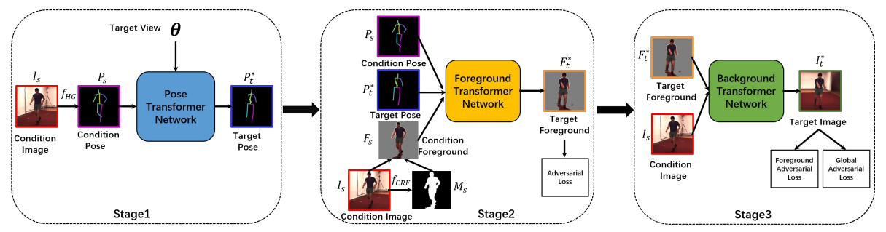
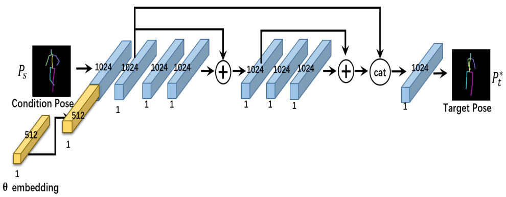
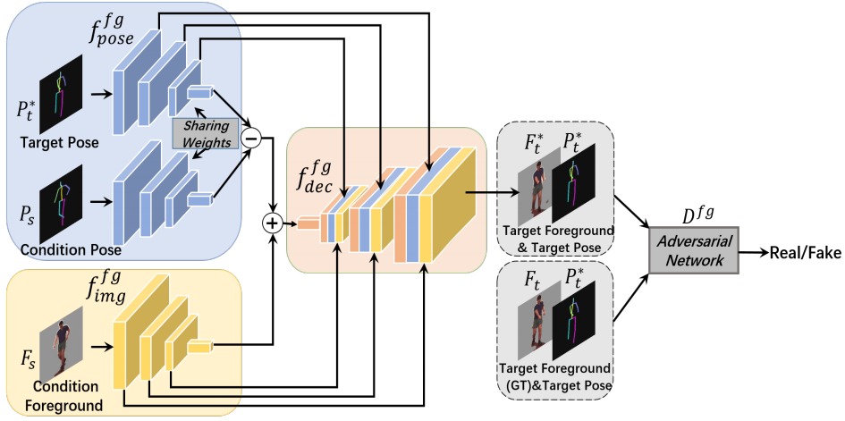
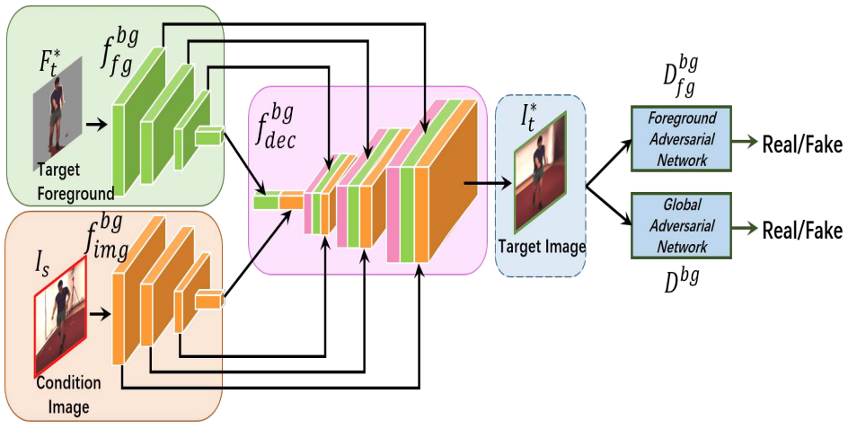

# Loss Function
## 常见任务中的Loss Function
### 分类任务

### 目标检测任务

### 实例分割任务

### 关键点检测任务

### 

## 实用Loss Function的代码解析（Caffe&Pytorch）
### YOLO-V2中的Loss Function

### RefineDET中的Loss Function

### 人脸识别模型中常用的Loss Function

## CVPR2018中的Loss Function的设计
### CosFace: Large Margin Cosine Loss for Deep Face Recognition
增强边缘余弦损失函数（LMCL）的定义：
$$L_{lmc}=\frac{1}{N}\sum_i{-\log{\frac{e^{s(cos(\theta_{y_i},i)-m)}}{e^{s(cos(\theta_{y_i},i)-m)}+\sum_{j\neq{y_i}}{e^{s*cos(\theta_j,i)}}}}}$$

约束条件：
$$W=\frac{W^*}{||W^*||},$$
$$x=\frac{x^*}{||x^*||},$$
$$cos(\theta_j,i)=W_j^Tx_i$$

### Wing Loss for Robust Facial Landmark Localisation with Convolutional Neural Networks
文章创新点：

+ **针对人脸关键点检测提出新的Loss Function —— Wing Loss**
+ 针对人脸姿态角度多样而导致的检测精度不高问题，提出一种基于姿态的数据均衡方法
+ 引入级联卷积神经网络的思想，用于人脸关键点检测，称为"Two-stage landmark localization"

Wing Loss的定义：
$$ wing(x)= \begin{cases} w\ln(1+\frac{|x|}{\varepsilon	
}) & \text {if $|x|<w$} \\ |x|-C & \text{otherwise} \end{cases}, $$

### Mean-Variance Loss for Deep Age Estimation from a Face
本文贡献：

+ 提出了一种新的损失函数，称为Mean-Variance Loss（均值-方差损失），目标是估计年龄分布，让均值尽可能接近ground-truth，同时方差尽可能小；
+ 与其他年龄分布学习方法不同的是，所提出的方法并不要求每个训练样本在模型训练期间必须具有平均年龄和方差的标签（无论是真实的还是假设的都不需要），还是可以给出一张人脸图片的分布估计；
+ 所提出的损失函数可以很容易嵌入到CNN模型中，并且可以通过SGD进行端到端的网络训练。

Mean-Variance Loss的定义：

均值损失
$$L_m=\frac{1}{2N}\sum_{i=1}^{N}{(m_i-y_i)^2}=\frac{1}{2N}\sum_{i=1}^{N}{(\sum_{j=1}^{N}{j*p_{i,j}}-y_i)^2}$$

方差损失
$$L_v=\frac{1}{N}\sum_{i=1}^{N}{v_i}=\frac{1}{N}\sum_{i=1}^{N}{\sum_{j=1}^{K}{p_{i,j}*(j-\sum_{k=1}^{K}{k*p_{i,k}})^2}}$$

### Triplet-Center Loss for Multi-View 3D Object Retrieval
本文贡献：

+ 首次将两种典型的损失函数，用于3D目标重建，并且全面分析了它们对重建性能的影响；
+ 提出了一种新的损失函数，叫做Triplet-center Loss（TCL），并且发现当在相同的CNN模型上使用TCL时能够获得SOT的结果，比其他方法更好。

Triplet-Center Loss的定义：

$$L_{tc}=\sum_{i=1}^{M}{\max(D(f_i,c_{y^i})+m-\min_{j\neq{y^i}}{D(f_i,c_j)},0)}$$

其中，

$$D(f_i,c_{y^i})=\frac{1}{2}{||f_i-c_{y^i}||_2^2}$$

最后使用的Loss Function：

$$L_{total}=\lambda L_{tc}+L_{softmax}$$

### Multistage Adversarial Losses for Pose-Based Human Image Synthesis
本文贡献：

+ 提出了一种基于姿态的人类图像合成方法，可以在新的视角下保持人的姿态不变，这对于现在最好的方法来说都是非常困难的；
+ 提出了一种多阶段对抗性损失计算方法，可以在新的视角下生成高质量的前景和背景图像；
+ 我们的方法能够在Human3.6M数据集上合成比一些SOT方法更好的全新视角人类图像。

文章提出的图像合成方法分为三个阶段，如图：

stage1(Pose Transformer Network)网络结构如下：

使用的Loss Function是L2 regression loss：

$$\mathcal{L}^1=\sum_{i}^{N}{||{P_t^*}^i-P_t^i||_2^2}$$

stage2(Foreground Transformer Network)网络结构如下：

使用的Loss Function：

$$\mathcal{L}^2=\alpha_f \mathcal{L}_{fg}^2+\beta_f \mathcal{L}_{bg}^2+\mathcal{L}_{gen}^2$$

其中，

$$\mathcal{L}_{fg}^2=||F_t\bigodot M_t-F_t^*\bigodot M_t||_1=\frac{1}{\sum_{M_t^{i,j}=1}{M_t^{i,j}}}\sum_{i,j}|(F_t^{i,j}-{F_t^*}^{i,j})\times{M_t^{i,j}}|$$

$$\mathcal{L}_{bg}^2=||F_t\bigodot{1-M_t}-F_t^*\bigodot{1-M_t}||_1=\frac{1}{\sum_{M_t^{i,j}=0}(1-M_t^{i,j})}{\sum_{i,j}|({F_t}^{i,j}-{F_t^*}^{i,j})\times{(1-M_t^{i,j})}|}$$

$$\mathcal{L}_{gen}^2=-\log(D^{fg}([F_t^*,P_t^*]))$$

$$\mathcal{L}_D^2=-\log(D^{fg}([F_t,P_t^*]))-\log(1-D^{fg}([F_t^*,P_t^*]))$$

stage3(Background Transformer Network)网络结构如下：

使用的Loss Function：

$$\mathcal{L}^3=\alpha_b\mathcal{L}_{fg}^3+\beta_b\mathcal{L}_{bg}^3+\mathcal{L}_{gen_{fg}}^3+\mathcal{L}_{gen}^3$$

其中，

$$\mathcal{L}_{gen_{fg}}^3=-\log(D_{fg}^{bg}([I_t^* \bigodot M_t,P_t^*]))$$

$$\mathcal{L}_{gen}^3=-\log(D^{bg}(I_t^*))$$

$$\mathcal{L}_{D_{fg}}^3=-\log(D_{fg}^{bg}([I_t \bigodot M_t,P_t^*]))-\log(1-D_{fg}^{bg}([I_t^* \bigodot M_t,P_t^*]))$$

$$\mathcal{L}_{D}^3=-\log(D^{bg}(I_t))-\log(1-D^{bg}(I_t^*))$$
