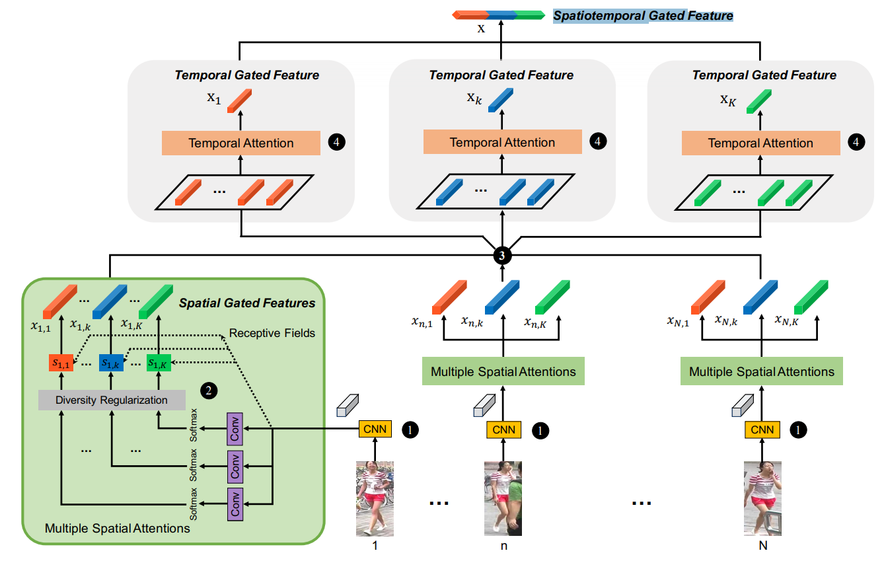

## Re-ID基本概念
定义：跨摄像头跨场景下行人的识别与检索。

技术难点：可能存在无正脸的照片、姿态、配饰、遮挡、相机拍摄角度差异、图片模糊、环境变化、服装更换、跨季节、光线差异等。

常用数据集：
+ Market1501：6个摄像头（5个高分辨率，1个低分辨率），视野范围存在重叠，包括32668个行人目标框，包括了1501个人。每个人至少出现在两个摄像头中，存在2793个干扰项。Market1501+500K用于测试模型是否过拟合Market1501。
+ DukeMTMC-reID：8个摄像头，1080p图片，36411张图，1812个人。
+ CUHK03：10个摄像头，1467个人，总共13164个行人目标框。

评价指标：
+ Rank-1：首位命中率，存在偶然因素
+ mAP：平均精度均值，先单独计算每张测试图片的精度，然后计算均值

## Re-ID相关文章介绍
### CVPR2018中的Re-ID
#### 1. Pose Transferrable Person Re-Identification
摘要：提出一个可迁移的Re-ID框架，利用迁移后的样本扩充（即ID监督）来增强Re-ID模型的训练。

网络结构：

#### 2. Deep Spatial Feature Reconstruction for Partial Person Re-identification: Alignment-free Approach
摘要：解决有遮挡的情况下的行人重识别问题。使用图像空域重建的方法得到与输入图像尺寸一致的空域特征图，借鉴字典学习中重建误差来计算不同的空域特征图的相似度。

网络结构：

效果：
主要在Partial ReID数据集上进行了评估，效果比较好。

#### 3. Adversarially Occluded Samples For Improving Generalization of Person Re-identification Models
摘要：用生成对抗网络来生成遮挡的样本，增加训练数据的多样性。这样做的好处：生成的是类似真实遮挡的样本；对于模型来说是困难样本，有利于训练过程跳出局部最优。

网络结构：

#### 4. Harmonious Attention Network for Person Re-Identification
摘要：行人重识别的训练很容易过拟合，行人很难对齐，背景复杂。

本文贡献：
+ 提出了一种新的联合学习多粒度Attention Selection和特征表示的方法，来优化Re-ID问题；
+ 提出了一种 Harmonious Attention CNN（HA-CNN）;
+ 提出了一个cross-attension交叉学习机制，进一步提高不同attention selection和Re-ID判别约束的特征表示之间的兼容性。

网络结构：

#### 5. Dual Attention Matching Network for Context-Aware Feature Sequence based Person Re-Identification
摘要：单张行人的图片生成的特征向量表示行人的时候会有很大的局限性，另一方面，视频序列中也有一些干扰帧，这将严重影响整个特征向量，从而导致无法匹配。

本文贡献：
+ 提出端到端的训练框架DuATM；
+ dual attention mechanism同时做序列内的feature refinement和序列间的特征对对齐;
+ 整个网络为栾生网络结构，triplet loss作为主要的loss函数，de-correlation loss和cross-entropy loss做辅助，并评估每个部分的有效性；
+ 在基于图像和视频的benchmark datasets上做了大量实验证明方法的有效性。

网络结构：

#### 6. Camera Style Adaptation for Person Re-identfication
摘要：样本太少，希望在训练集中增加更多样本来表示不同摄像机之间的风格差异；提出使用cycleGAN完成风格转换，损失函数使用cycleGAN loss和identify mapping loss。增加数据多样性会防止过拟合，但是会产生很多噪声；提出在风格转换的生成样本上应用标签平滑正则化（LSR），以便他们的标签在训练期间更soft。

本文贡献：
+ 提出了一个用于Re-ID数据增强的摄像机感知风格迁移模型，在少数相机系统中，提升可以达到17.1%；
+ 在训练Re-ID期间对风格迁移样本应用LSR的方法软化监督，在所有相机系统中都可以得到一致的提升。

网络结构：

代码：[CamStyle](https://github.com/zhunzhong07/CamStyle)

#### 7. Image-Image Domain Adaptation with Preserved Self-Similarity and Domain-Dissimilarity for Person Re-identification
摘要：关注跨数据集下的性能表现，发现在一个数据集上训练的模型直接用在另一个数据集上，模型性能会大幅下降。使用迁移学习解决跨数据集的模型训练问题。

网络结构：

代码：[Learning_via_Translation](https://github.com/Simon4Yan/Learning-via-Translation)

效果：
实验对比主要集中在跨数据集的模型性能对比上。

#### 8. Person Transfer GAN to Bridge Domain Gap for Person Re-Identification
摘要：通过对抗网络实现不同数据集之间的风格迁移，算法和Camera Style差异性不大；另外，提出了一个大的数据集MSMT17，15个相机（12个室外，3个室内），180小时视频，4101个行人，126441个目标框。

#### 9. Unsupervised Cross-dataset Person Re-identification by Transfer Learning of Spatial-Temporal Patterns
摘要：直接将训练好的模型部署到大规模现实世界摄像头系统中可能会由于欠拟合导致性能很差。提出一种非监督增量学习算法TFusion，对目标域中行人的时空模式进行迁移；提出贝叶斯融合模型将学习的时空模式与视觉特征相结合，实现对分类器的改进。

网络结构：

代码：[TFusion](https://github.com/ahangchen/TFusion)

效果：
实验对比主要集中无监督学习的模型性能对比上。

#### 10. Mask-guided Contrastive Attention Model for Person Re-Identification
摘要：如何提取对背景杂乱不变的判别和鲁棒特征是核心问题。提出基于目标分割掩模的方式，通过去除背景达到比较好的效果。

本文贡献：
+ 设计了一个由二值Mask引导的对比注意力模型，可以生成一对身体感知和背景感知的注意力图，用于生成身体和背景的特征，这样可以减少带Mask的人物图像背景杂乱；
+ 提出来自完整图像，身体和背景三者的区域级别的Triplet Loss。可以引导模型学习那些对背景杂乱不变性的特征；
+ 探索了将身体Mask作为附加输入项，和RGB图像一起输入到模型，从而增强Re-ID模型的特征学习，Mask的优点包括，帮助减少背景杂乱，同时包含了身体形状等与身份相关的信息。

网络结构：

#### 11. A Pose-Sensitive Embedding for Person Re-Identification with Expanded Cross Neighborhood Re-Ranking
本文贡献：
+ 提出一种新的CNN嵌入方式，将粗粒度和细粒度的人体姿态信息嵌入到CNN中；
+ 提出一种新的无监督和重排序方法，实现较大程度的重排名改进；
+ 提出的pose-sensitive行人重识别模型和re-ranking方法在四个数据集达到SOT水平。

网络结构：

代码：[PSE-ECN](https://github.com/pse-ecn)

#### 12. Disentangled Person Image Generation
摘要：‘pose guided person image generation’文章的后续文章，目标依然是生成图片，通过学习图像因素的分解表达产生新的任务图片。

本文贡献：
+ 提出一个多分支的重构网络，将三个因素分解和编码到嵌入特征中，这些特征结合起来用来重组输入的图片；
+ 用对抗的方式学习三个映射关系，分别对于每个因素将高斯噪声映射到学习的嵌入特征空间中；

网络结构：

代码：[仅工程，还未公开代码](https://github.com/pse-ecn)

效果：主要是和无监督训练的模型进行比较。

#### 13. Diversity Regularized Spatiotemporal Attention for Video-based Person Re-identification
摘要：主要关注在视频Re-ID挑战数据集上，从视频中提取有用的信息。

本文贡献：
+ 空间注意力可以解决图像之间的对齐问题，并且避免被遮挡区域破坏的特征；
+ 尽管身体的部位对于识别来说很重要，但是太阳镜、背包和帽子等配饰对于Re-ID来说也是很有用的。对于这些配饰，提出采用无监督学习的方法，让网络自己发现这些目标（空间注意力模型）；
+ 使用基于Hellinger距离的新型多样性正则化项，确保多个空间注意力模型不会发现相同的身体部位；
+ 使用时间注意力模型来计算由每个空间注意力模型提取的特征的聚合表示，将这些聚合表示连接成最终的特征向量，该向量表示整个视频中可用的所有信息。

网络结构：

代码：[DRSA](https://github.com/ShuangLI59/Diversity-Regularized-Spatiotemporal-Attention)

#### 14. Efficient and Deep Person Re-Identification using Multi-Level Similarity
摘要：作者发现多级相似性可以在Re-ID问题中使用低复杂度的网络结构来提高准确性。

本文贡献：
+ 提出了一个全卷积栾生网络用于行人Re-ID，叫做Convolution Similaity Network。可以提高两个输入图像之间相似度的值。这个模块利用了注意力机制，并且可以有效的实施；
+ 计算不同级别的视觉相似度，将它们组合以实现鲁棒的匹配/不匹配分类；
+ 具有较低的计算复杂度，结果具有竞争力。

网络结构：

效果：以快为主

#### 15. Exploit the Unknown Gradually One-Shot Video-Based Person Re-Identification by Stepwise Learning
摘要：通过逐渐利用未标注样本，来解决one-shot情况下的视频行人Re-ID问题。即对于每个行人，只需要标注其中一段视频，其他视频通过算法自己探索。

代码：[Exploit-Unknown-Gradually](https://github.com/Yu-Wu/Exploit-Unknown-Gradually)

效果：主要关注在无监督或者半监督学习上。

#### 16. Exploiting Transitivity for Learning Person Re-identification Models on a Budget
摘要：专注于数据标记工作最小化问题。提出将所有摄像机表示为边缘加权的完整K-partite图，每个顶点表示行人，行人之间的相似性得分作为边缘权重；然后通过求解K-partite图上的三角形自由子图最大化问题来选择最佳的成对子集；此外提出了两个多项式时间近似最优算法，在三个数据集上的实验表明，所提出的方法平均仅需要8-15%的手动标注量就能达到手动标注的性能。

#### 17. Features for Multi-Target Multi-Camera Tracking and Re-Identification
摘要：研究多目标多相机跟踪问题，即从多个相机拍摄的视频中跟踪多个人；同时也研究Re-ID任务。通过CNN来学习MTMCT和Re-ID任务中良好的特征。

本文贡献：
+ 提出一个自适应的加权Triplet Loss，与固定权重不一样，它兼顾了准确度和稳定性；
+ 提出一个很简单的困难样例挖掘策略，有助于学习更好的特征；
+ 提出现在的基准中关于跟踪和排序精确度之间相关性的新的观点；
+ 通过实验显示，本文的特征在MTMCT和Re-ID任务上都超过了SOT。

网络结构：

代码：[Project](http://vision.cs.duke.edu/DukeMTMC/)

#### 18. Human Semantic Parsing for Person Re-identification
本文贡献：
+ 提出的简单有效的训练程序可以明显优于当前最先进的技术，用Inception-V3和ResNet-152在三个不同的基准测试中都得到了验证；
+ 提出了SPReID，使用人类语义解析来利用本地视觉提示来进行行人重识别。训练语义分割模型，并证明了它不仅有助于改善行人重识别，而且还实现了人类语义分析问题的最好表现；
+ 提升了最先进的行人再识别性能。

网络结构：

代码：[SPReID](https://github.com/emrahbasaran/SPReID)

#### 19. Multi-Level Factorisation Net for Person Re-Identification
摘要：行人再识别的关键在于高语义和低语义水平上对行人外观的判别和视图不变因素进行建模。本文提出多层次因子分析网络（MLFN），将行人的视觉外观分解为多个语义级别的潜在判别因素而无需人工标注。MLFN由多个堆叠块组成，每个块包含多个因子模块以模拟特定级别的潜在因子，以及因子选择模块，其动态地选择因子模块以解释每个输入图像的内容。因子选择模块的输出还提供紧凑的潜在因子描述符，其与传统深度学习的特征互补。MLFN在三个Re-ID数据集上实现了最先进的结果，并在一般对象分类CIFAR-100数据集上获得了令人信服的结果。

本文贡献：

网络结构：

代码：

#### 20. Multi-shot Pedestrian Re-identification via Sequential Decision Making
摘要：

本文贡献：

网络结构：

代码：

#### 21. Person Re-identification with Cascaded Pairwise Convolutions
摘要：

本文贡献：

网络结构：

代码：

#### 22. Resource Aware Person Re-identification across Multiple Resolutions
摘要：

本文贡献：

网络结构：

代码：

#### 23. Unsupervised Person Image Synthesis in Arbitrary Poses
摘要：

本文贡献：

网络结构：

代码：

#### 24. Group Consistent Similarity Learning via Deep CRFs for Person Re-Identification
摘要：

本文贡献：

网络结构：

代码：

#### 25. Video Person Re-identification with Competitive Snippet-similarity Aggregation and Co-attentive Snippet Embedding
摘要：

本文贡献：

网络结构：

代码：

#### 26. Attention-aware Compositional Network for Person Re-Identification
摘要：

本文贡献：

网络结构：

代码：

#### 27. Deep Group-shuffling Random Walk for Person Re-identification
摘要：

本文贡献：

网络结构：

代码：

#### 28. Easy Identification from Better Constraints: Multi-Shot Person Re-Identification from Reference Constraints
摘要：

本文贡献：

网络结构：

代码：

#### 29. Eliminating Background-bias for Robust Person Re-identification
摘要：

本文贡献：

网络结构：

代码：

#### 30. End-to-End Deep Kronecker-Product Matching for Person Re-identification
摘要：

本文贡献：

网络结构：

代码：

#### 31. Deep Mutual Learning
摘要：

本文贡献：

网络结构：

代码：

