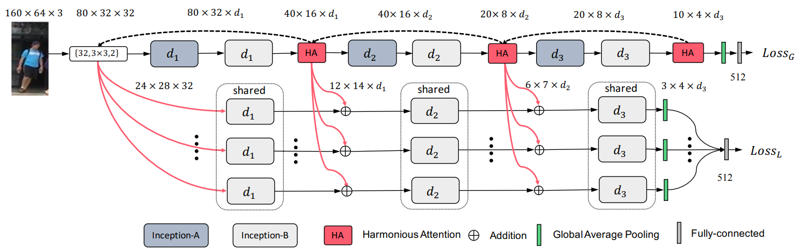

## Re-ID基本概念
定义：跨摄像头跨场景下行人的识别与检索。

技术难点：可能存在无正脸的照片、姿态、配饰、遮挡、相机拍摄角度差异、图片模糊、环境变化、服装更换、跨季节、光线差异等。

常用数据集：
+ Market1501：6个摄像头（5个高分辨率，1个低分辨率），视野范围存在重叠，包括32668个行人目标框，包括了1501个人。每个人至少出现在两个摄像头中，存在2793个干扰项。Market1501+500K用于测试模型是否过拟合Market1501。
+ DukeMTMC-reID：8个摄像头，1080p图片，36411张图，1812个人。
+ CUHK03：10个摄像头，1467个人，总共13164个行人目标框。

评价指标：
+ Rank-1：首位命中率，存在偶然因素
+ mAP：平均精度均值，先单独计算每张测试图片的精度，然后计算均值

## Re-ID相关文章介绍
### CVPR2018中的Re-ID
#### 1. Pose Transferrable Person Re-Identification
摘要：提出一个可迁移的Re-ID框架，利用迁移后的样本扩充（即ID监督）来增强Re-ID模型的训练。

网络结构：

#### 2. Deep Spatial Feature Reconstruction for Partial Person Re-identification: Alignment-free Approach
摘要：解决有遮挡的情况下的行人重识别问题。使用图像空域重建的方法得到与输入图像尺寸一致的空域特征图，借鉴字典学习中重建误差来计算不同的空域特征图的相似度。

网络结构：

效果：
主要在Partial ReID数据集上进行了评估，效果比较好。

#### 3. Adversarially Occluded Samples For Improving Generalization of Person Re-identification Models
摘要：用生成对抗网络来生成遮挡的样本，增加训练数据的多样性。这样做的好处：生成的是类似真实遮挡的样本；对于模型来说是困难样本，有利于训练过程跳出局部最优。

网络结构：

#### 4. Harmonious Attention Network for Person Re-Identification
摘要：行人重识别的训练很容易过拟合，行人很难对齐，背景复杂。

本文贡献：
+ 提出了一种新的联合学习多粒度Attention Selection和特征表示的方法，来优化Re-ID问题；
+ 提出了一种 Harmonious Attention CNN（HA-CNN）;
+ 提出了一个cross-attension交叉学习机制，进一步提高不同attention selection和Re-ID判别约束的特征表示之间的兼容性。

网络结构：

#### 5. Dual Attention Matching Network for Context-Aware Feature Sequence based Person Re-Identification
摘要：单张行人的图片生成的特征向量表示行人的时候会有很大的局限性，另一方面，视频序列中也有一些干扰帧，这将严重影响整个特征向量，从而导致无法匹配。

本文贡献：
+ 提出端到端的训练框架DuATM；
+ dual attention mechanism同时做序列内的feature refinement和序列间的特征对对齐;
+ 整个网络为栾生网络结构，triplet loss作为主要的loss函数，de-correlation loss和cross-entropy loss做辅助，并评估每个部分的有效性；
+ 在基于图像和视频的benchmark datasets上做了大量实验证明方法的有效性。

网络结构：

#### 6. Transferable Joint Attribute-Identity Deep Learning for Unsupervised Person Re-Identification
摘要：开发了一种新颖的深度学习方法，将现有数据集的标记信息转换为新的不可见（未标记）的目标域，以便在目标域中没有任何监督学习的情况下进行行人识别。引入了一个可迁移的联合属性 - 身份深度学习（TJ-AIDL），用于同时学习可迁移到任何新的（看不见的）目标域的属性 - 语义和身份差异特征表示空间，用于re-id任务。

本文贡献：
+ 提出端到端的训练框架DuATM；
+ dual attention mechanism同时做序列内的feature refinement和序列间的特征对对齐;
+ 整个网络为栾生网络结构，triplet loss作为主要的loss函数，de-correlation loss和cross-entropy loss做辅助，并评估每个部分的有效性；
+ 在基于图像和视频的benchmark datasets上做了大量实验证明方法的有效性。

网络结构：

1. Camera Style Adaptation for Person Re-identfication【paper】【github】

2. Image-Image Domain Adaptation with Preserved Self-Similarity and Domain-Dissimilarity for Person Re-identification【paper】

3. Person Transfer GAN to Bridge Domain Gap for Person Re-Identification 【paper】

DataSet【Baidu】（password: tkdr）【Google】

10. Unsupervised Cross-dataset Person Re-identification by Transfer Learning of Spatial-Temporal Patterns【paper】【github】

11. Mask-guided Contrastive Attention Model for Person Re-Identification 【】

12. A Pose-Sensitive Embedding for Person Re-Identification with Expanded Cross Neighborhood Re-Ranking 【paper】

13. Disentangled Person Image Generation【paper】

14. Diversity Regularized Spatiotemporal Attention for Video-based Person Re-identification【paper】

15. Efficient and Deep Person Re-Identification using Multi-Level Similarity【paper】

16. Exploit the Unknown Gradually One-Shot Video-Based Person Re-Identification by Stepwise Learning【paper】self

17. Exploiting Transitivity for Learning Person Re-identification Models on a Budget【paper】self

18. Features for Multi-Target Multi-Camera Tracking and Re-Identification【paper】【github】

貌似改名了：Good Appearance Features for Multi-Target Multi-Camera Tracking

19. Human Semantic Parsing for Person Re-identification【paper】

20. Multi-Level Factorisation Net for Person Re-Identification【paper】

21. Multi-shot Pedestrian Re-identification via Sequential Decision Making【paper】

22. Person Re-identification with Cascaded Pairwise Convolutions【】

23. Resource Aware Person Re-identification across Multiple Resolutions【paper】self

24. Unsupervised Person Image Synthesis in Arbitrary Poses【paper】self

25. Group Consistent Similarity Learning via Deep CRFs for Person Re-Identification【】

26. Video Person Re-identification with Competitive Snippet-similarity Aggregation and Co-attentive Snippet Embedding【】

27. Attention-aware Compositional Network for Person Re-Identification【】

28. Deep Group-shuffling Random Walk for Person Re-identification【】

29. Easy Identification from Better Constraints: Multi-Shot Person Re-Identification from Reference Constraints【】

30. Eliminating Background-bias for Robust Person Re-identification【】

31. End-to-End Deep Kronecker-Product Matching for Person Re-identification【】

32. Deep Mutual Learning【paper】

